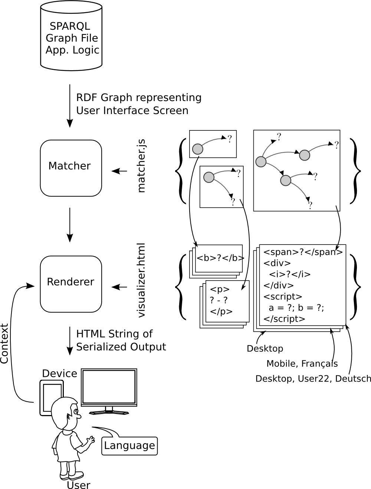

UDUVUDU 
-------

**Uduvudu** aims to be an easy to use **extensible** and **adaptive** RDF User Interface engine. With Uduvudu you can create an interface screen by defining a graph and providing reusable __matchers__ as also __templates__. 

The aim of this framework is to consume/render roughly the amount of triples which can be presented on one page or one screen. This can be done in a extremly flexible and also reusable way. The cost you are paying it that the framework is inherently not able to process big ( >10'000 triples ) amounts of data.

Current State
-------------
The library is now working in all recent major browsers. Right now the libary can read RDF in Turtle, N-Triple, RDF/XML and JSON-LD through the [rdf-ext](https://github.com/zazukoians/rdf-ext/) library.

A [live demo on DBpedia](http://dbpedia.exascale.info/) data is available as a proof of concept application.

Overview
--------
Uduvudu consists internally out of two parts. First the [Matcher](/doc/matcher.md) which extracts defined structures based on descriptions. Second the [Renderer](/doc/templates.md) which incorporates the context (language and device) and uses templates to render the final output.

Use
---

[Install](/doc/install.md): How to integrate Uduvudu and the necessary dependencies in your project.

[Editor](/doc/editor.md): An overlay editor which can be used inplace in your project.

[Add Matcher](/doc/matcher.md): How to define your own matchers definitions.

[Add Templates](/doc/templates.md): How to define your own templates.

[JsFiddle of the example_styles_rdf.html](http://jsfiddle.net/j862exfp/12/)

Extend
------
You can extend the library by adding new matcher factories. Please study the functions `uduvudu.matchers.*` in `src/uduvudu.js` which define the current available matcher as factories.

Development
----------

To build the JavaScript files to distribute run `node build.js`

Related Work
------------
The following projects are currently also working on adaptive and easy to use frameworks with similar goals. Check them out!

[Balloon Synopsis](http://schlegel.github.io/balloon/balloon-synopsis.html)

[RSLT](https://github.com/fvitali/rslt)

[Linked Data Reactor](http://ld-r.org/)

References
----------
Uduvudu in-use examples.

### [EIS - Uni Bonn](http://eis.iai.uni-bonn.de/About.html)
  * [Display Team Members](http://aksakalli.github.io/uduvudu-demo/)

### [Nexa Center for Internet & Society, Politecnico di Torino](http://nexa.polito.it/)
  * [Public Contracts](http://public-contracts.nexacenter.org/)
  * [LOD Events eXplorer](http://explorer.nexacenter.org/)

